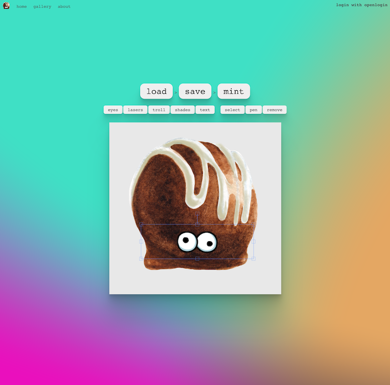

# Truffle Creator

Create your very own Truffle NFT!



## Installation 💾

Install the dependencies with the following (assuming you have [yarn](https://classic.yarnpkg.com/en/) installed).

```bash
yarn
```

Spin up a local chain and migrate the contracts.

```bash
truffle develop
$ migrate
```

Start the front-end.

```
yarn start
```

## Libraries 🙏

- [ethers](https://docs.ethers.io/v5/)
- [ipfs-mini](https://github.com/silentcicero/ipfs-mini)
- [react-sketch](https://github.com/tbolis/react-sketch)
- [react-router](https://reactrouter.com/)
- [react-svg](https://www.npmjs.com/package/react-svg)
- [react-bulma-components](https://www.npmjs.com/package/react-bulma-components)
- [openzeppelin-contracts](https://github.com/OpenZeppelin/openzeppelin-contracts)
